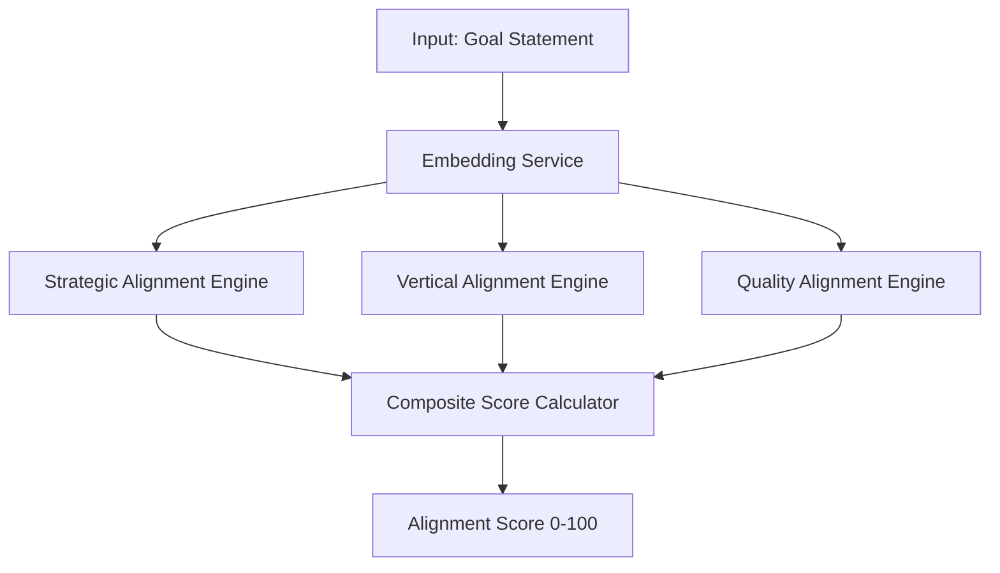
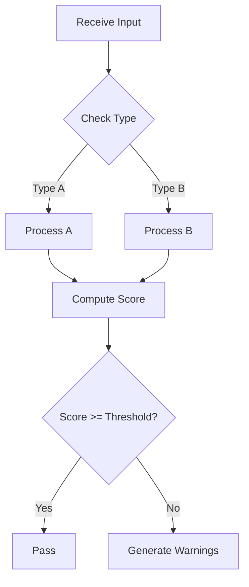
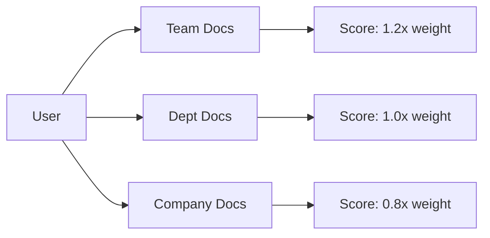

Generate filing-quality patent disclosure documents (JSON + PDF + quality score).

## Usage

```
/patent-disclosure
> go                          ← scans codebase, generates disclosures for ALL innovations

/patent-disclosure INV-001
> go                          ← generates disclosure for specific innovation
```

After invoking the skill, type `go` (or `scan`, `generate`, etc.) to start execution.

## Process

### Step 1: Gather Innovation Details

If using innovation ID:
```
1. Load innovation from scan results
2. Read all source files listed
3. Extract technical implementation details
4. Identify key algorithms and data structures
```

If using direct description:
```
1. Search codebase for related files
2. Read and analyze implementation
3. Extract technical details
4. Validate description against code
```

### Step 2: Analyze Problem Statement

Extract from:
- Code comments explaining "why"
- README problem descriptions
- Comparison with alternatives in comments
- Error messages showing what goes wrong without this solution

Generate 2-3 paragraphs covering:
- Current state of the art
- Limitations of existing approaches
- Specific technical problems

### Step 3: Generate Summary

Write 2-3 paragraphs covering:
- High-level solution approach
- Key innovations
- Benefits and improvements

### Step 4: Generate Abstract

Write filing-quality abstracts for both English and Traditional Chinese (繁體中文).

#### English Abstract Process (USPTO 37 CFR 1.72(b))

1. **Read Claim 1** (method claim) and the summary section
2. **Write a single paragraph**, maximum 150 words, that states:
   - What the invention is
   - What problem it solves
   - How it works (key technical steps)
3. **Use the same terminology as Claim 1** — every technical term in the abstract must match the claim language exactly
4. **Verify word count** — must be ≤ 150 words
5. **Scan for forbidden phrases** and remove:
   - "the invention", "the present invention"
   - "is disclosed", "this disclosure"
   - "obviously", "simply", "easily"

#### Traditional Chinese Abstract Process (TIPO)

1. **Translate the English abstract** into Traditional Chinese
2. **Apply the TW term mapping** — replace any mainland terminology:

   | Mainland (禁用) | Taiwan (使用) |
   |-----------------|--------------|
   | 算法 | 演算法 |
   | 软件 | 軟體 |
   | 服务器 | 伺服器 |
   | 数据库 | 資料庫 |
   | 信息 | 資訊 |
   | 接口 | 介面 |
   | 缓存 | 快取 |

3. **Verify formal register** (書面語) — no colloquial expressions
4. **Verify character count** — must be ≤ 300 characters
5. **Verify character set** is Traditional (繁體), not Simplified (简体)

#### Abstract Template

```json
{
  "abstract": {
    "en": "A computer-implemented method for [what it is] that addresses [problem] by [how it works]. The method comprises [key steps]. The system achieves [key benefit].",
    "zh_tw": "一種電腦實施的[what]方法，透過[how]解決[problem]。該方法包含[key steps]，實現[benefit]。"
  }
}
```

### Step 5: Extract Detailed Description

For each component:

```json
{
  "name": "Component Name",
  "weight": 0.40,  // if applicable
  "description": "Technical description",
  "sub_components": [
    {
      "name": "Sub-component",
      "description": "Details"
    }
  ]
}
```

Include:
- System architecture overview
- Each major component with weights/priorities
- Formulas and algorithms
- Data flows
- Special handling (bilingual, caching, etc.)

#### Specification Prose Quality Rules

Apply these rules while writing the detailed description to ensure filing-quality prose:

1. **Claim-spec alignment** — every element mentioned in any claim MUST appear in the detailed description with a full explanation of how it works. If a claim says "computing a weighted alignment score", the spec must describe the weighting mechanism.
2. **Embodiment variations** — include "In some implementations..." or "In one embodiment..." variations for key features to provide flexibility during prosecution.
3. **No value judgments** — remove "superior", "optimal", "best", "ideal", "perfect". Use neutral language describing what the system does, not how good it is.
4. **Terminology consistency** — use the exact same terms as the claims throughout the spec. If the claim says "goal statement", never switch to "objective text" or "target description" in the spec.
5. **Formula completeness** — every formula must define all variables with units and ranges where applicable.

### Step 6: Draft Claims

Generate filing-quality patent claims following the method/system/CRM triad. See `references/patent-writing-guide.md` for the full writing guide.

#### 6.1 Identify Core Inventive Steps

Before writing any claims, extract the core inventive steps from the code analysis:

1. List the 3-6 key technical steps that make this innovation novel
2. Order them logically (input → processing → output)
3. Identify which steps differentiate from prior art
4. These steps form the basis for all three independent claims

#### 6.2 Write Method Claim (Independent Claim 1)

Write the method claim first — it serves as the foundation for the other two:

```
A computer-implemented method for [function], comprising:
(a) receiving, by a processor, [first input];
(b) computing, by the processor, a first [result] by [technical step];
(c) determining, by the processor, a second [result] based on [technical step]; and
(d) generating, by the processor, [output] based on the first [result] and the second [result].
```

- Preamble: "A computer-implemented method for [function], comprising:"
- Each step as a gerund phrase with "by a processor" attribution
- Final step produces the key output
- Keep independent claims broad — no implementation specifics

#### 6.3 Write System Claim (Independent Claim 2)

Adapt the method claim to system language:

```
A system comprising:
a processor; and
a non-transitory computer-readable medium storing instructions that, when executed by the processor, cause the processor to:
[same steps as method claim, adapted to system language].
```

#### 6.4 Write CRM Claim (Independent Claim 3)

Adapt the method claim to computer-readable medium:

```
A non-transitory computer-readable medium storing instructions that, when executed by a processor, cause the processor to perform operations comprising:
[same steps as method claim].
```

#### 6.5 Write Dependent Claims (Claims 4-N)

```
The method of claim 1, wherein [specific implementation detail].
```

- Each dependent claim adds one specific implementation detail
- Duplicate relevant dependents for system claim (e.g., "The system of claim 2, wherein...") and CRM claim (e.g., "The non-transitory computer-readable medium of claim 3, wherein...")
- Target 5-10 dependent claims per independent claim
- Cover key differentiators from prior art

#### 6.6 Renumber All Claims

After drafting, renumber sequentially:
- Claim 1: Method (independent)
- Claim 2: System (independent)
- Claim 3: CRM (independent)
- Claims 4-N: Dependent claims referencing the correct parent

#### 6.7 Antecedent Basis Audit (CRITICAL — DO NOT SKIP)

Antecedent basis failures are the #1 USPTO rejection reason. After drafting all claims, run this audit:

1. **For each claim**, extract every noun phrase
2. **Check first mention** uses "a" or "an": `"receiving a goal statement"`
3. **Check subsequent mentions** use "the" or "said": `"comparing the goal statement"`
4. **Check dependent claims** — every element must trace back to an element in the parent claim chain
5. **Fix any violations** before proceeding

**Example fix:**
```
BEFORE (violation): "...comparing the alignment score with the threshold..."
       (neither "alignment score" nor "threshold" was introduced)

AFTER  (fixed): "...comparing a computed alignment score with a predefined threshold..."
```

**Consistency rule:** Once you call it "goal statement", never switch to "objective text" — same term throughout all claims and specification.

#### 6.8 Forbidden Language Scan (MANDATORY)

After drafting all claims AND specification text, scan ALL text fields and apply replacements:

| Find | Replace with |
|------|-------------|
| "the invention" | "the disclosed method" or "the system" |
| "the present invention" | "in some implementations" |
| "obviously" / "simply" / "easily" | Remove entirely |
| "important" / "critical" / "key" (as adjectives) | Remove or rephrase neutrally |
| "always" / "never" / "must" | "in one embodiment" / "may" / "can" |
| "preferred embodiment" | "in one embodiment" |

This scan covers claims, abstract, problem statement, summary, and detailed description — every text field in the disclosure.

#### Targets

- 3 independent claims (method + system + CRM triad)
- 5-10 dependent claims covering specifics per independent claim
- Claims covering key differentiators
- Every element properly introduced with antecedent basis
- Zero forbidden language instances

### Step 7: Prior Art Search & Differentiation

Conduct comprehensive prior art search to validate novelty and document differentiation.

#### 7.1 Extract Search Terms

From the innovation, extract:

| Term Type | Description | Example |
|-----------|-------------|---------|
| **Primary** | Core technology concepts | "OKR alignment", "goal scoring" |
| **Secondary** | Implementation details | "multi-dimensional scoring", "semantic similarity" |
| **Domain** | Industry vocabulary | "enterprise goal management", "performance management" |
| **Alternative** | Synonyms | "KPI alignment", "objective scoring" |

#### 7.2 Search Technical Documentation (Context7)

If Context7 MCP is available:

```
1. Resolve library IDs for relevant technologies:
   - context7:resolve-library-id("langchain") → RAG implementations
   - context7:resolve-library-id("dspy") → AI scoring systems

2. Query documentation for similar features:
   - context7:query-docs(libraryId, "alignment scoring")
   - context7:query-docs(libraryId, "multi-dimensional evaluation")
```

#### 7.3 Search Patent Databases

Use web search with these patterns:

| Database | Search Pattern |
|----------|----------------|
| Google Patents | `"[innovation]" site:patents.google.com` |
| USPTO | `"[innovation]" site:patft.uspto.gov` |
| WIPO | `"[innovation]" site:patentscope.wipo.int` |

#### 7.4 Search Academic Literature

| Database | Search Pattern |
|----------|----------------|
| arXiv | `"[innovation]" site:arxiv.org` |
| IEEE | `"[innovation]" site:ieeexplore.ieee.org` |
| ACM | `"[innovation]" site:dl.acm.org` |

#### 7.5 Assess Relevance

For each result found, score relevance:

| Criteria | Score 0-3 | Question |
|----------|-----------|----------|
| Technical Overlap | 0-3 | Same technical approach? |
| Problem Overlap | 0-3 | Solving same problem? |
| Implementation Overlap | 0-3 | Similar implementation? |
| Claims Overlap | 0-3 | Could block our claims? |

**Total Score Interpretation:**
- 0-3: Low relevance — note but no concern
- 4-6: Medium relevance — document differentiation
- 7-9: High relevance — may need to narrow claims
- 10-12: Critical — consult patent counsel

#### 7.6 Document Findings

For each relevant prior art, record:

```json
{
  "name": "Prior Art Name",
  "type": "patent | product | paper | open_source",
  "description": "What it does",
  "limitation": "What it lacks / why insufficient",
  "differentiation": "How our invention differs"
}
```

#### 7.7 If Context7 Unavailable

Provide manual search guidance with links:
- Google Patents: https://patents.google.com
- USPTO: https://patft.uspto.gov
- arXiv: https://arxiv.org
- Google Scholar: https://scholar.google.com

### Step 8: Generate Mermaid Diagrams (DO NOT SKIP)

Before writing the JSON, you MUST create Mermaid diagrams. This step is consistently skipped — do not skip it.

Generate at least 3 diagrams:

**FIG. 1 — System Architecture** (use `graph TD`):


**FIG. 2 — Process Flowchart** (use `flowchart TD`):


**FIG. 3 — Data Flow or Hierarchy** (use `graph LR`):


Replace the example content with actual diagrams based on the innovation's architecture. Store these in the `drawings` array with `mermaid_code` field — the PDF generator renders them as images.

### Step 9: Generate JSON Output

**CRITICAL: You MUST execute the generation script to write files to disk.**

**Output location:** All output files are saved to the **current project directory** (where you invoked the command), NOT the plugin installation directory.

After gathering all information (Steps 1-8), you MUST:

1. Create the disclosure JSON object with all 8 sections (including `drawings` with `mermaid_code`)
2. Find the plugin script and pipe the JSON to it (output to current project):

```bash
# Find the plugin's script location
PLUGIN_DIR=$(find ~/.claude -name "generate-disclosure.py" -path "*/vs-patent-miner/*" 2>/dev/null | head -1 | xargs dirname | xargs dirname)

# Save to CURRENT PROJECT directory
cat << 'EOF' | python3 "$PLUGIN_DIR/scripts/generate-disclosure.py" [INNOVATION-ID] ./output/disclosures/[INNOVATION-ID]-disclosure.json
{
  "id": "[INNOVATION-ID]",
  "title": "...",
  "title_zh": "...",
  "field_of_invention": ["..."],
  "inventors": ["..."],
  "assignee": "...",
  "abstract": {
    "en": "A computer-implemented method for ... comprising ...",
    "zh_tw": "一種電腦實施的...方法，包含..."
  },
  "problem_statement": {
    "background": ["paragraph 1", "paragraph 2"]
  },
  "summary": {
    "overview": ["paragraph 1", "paragraph 2"],
    "key_innovations": ["innovation 1", "innovation 2"]
  },
  "detailed_description": {
    "system_architecture": "...",
    "components": [
      {"name": "...", "weight": 0.4, "description": "..."}
    ]
  },
  "claims": [
    {"claim_number": 1, "claim_type": "independent", "text": "..."}
  ],
  "drawings": [
    {
      "figure_number": 1,
      "title": "System Architecture",
      "description": "Architecture diagram showing major components",
      "type": "architecture",
      "mermaid_code": "graph TD\n    A[Input] --> B[Component 1]\n    B --> C[Component 2]\n    C --> D[Output]"
    },
    {
      "figure_number": 2,
      "title": "Process Flowchart",
      "description": "Flowchart showing the main process",
      "type": "flowchart",
      "mermaid_code": "flowchart TD\n    A[Start] --> B{Decision}\n    B -->|Yes| C[Action 1]\n    B -->|No| D[Action 2]"
    },
    {
      "figure_number": 3,
      "title": "Data Flow",
      "description": "Data flow between system components",
      "type": "flowchart",
      "mermaid_code": "graph LR\n    A[Source] --> B[Process] --> C[Store]"
    }
  ],
  "prior_art": {
    "reviewed_systems": [
      {"name": "...", "type": "product", "description": "...", "limitation": "..."}
    ],
    "differentiation": "..."
  }
}
EOF
```

3. Verify the file was created in the **current project**:
```bash
ls -la ./output/disclosures/
```

**DO NOT skip the script execution. The script ensures files are written to disk.**

**IMPORTANT:** Output paths like `./output/disclosures/` are relative to the current working directory (your project), not the plugin directory.

## Document Structure (8 Sections)

The disclosure JSON MUST contain these sections:

1. **Metadata** — Title, title_zh, application number, inventors, assignee, field of invention
2. **Abstract** — EN max 150 words, TW Chinese max 300 chars
3. **Problem Statement** — Background and limitations of existing approaches
4. **Summary of Invention** — Overview paragraphs + key_innovations list
5. **Detailed Description** — Components, architecture, formulas, algorithms
6. **Claims** — Independent (method + system + CRM triad) and dependent claims
7. **Drawings** — Architecture diagrams with Mermaid code (REQUIRED)
8. **Prior Art** — Reviewed systems and differentiation

**CRITICAL: The `drawings` array with `mermaid_code` is the most commonly skipped section. You MUST verify it exists in the JSON before writing to disk. If your JSON has no `drawings` field, STOP and add it.**

### Drawings — REQUIRED

Every disclosure MUST include a `drawings` array with at least 3 figures. Each drawing MUST have a `mermaid_code` field containing valid Mermaid syntax. The PDF generator renders these as diagrams.

```json
{
  "drawings": [
    {
      "figure_number": 1,
      "title": "System Architecture",
      "description": "Architecture diagram showing major components and data flow",
      "type": "architecture",
      "mermaid_code": "graph TD\n    A[Input] --> B[Module 1]\n    B --> C[Module 2]\n    C --> D[Output]"
    },
    {
      "figure_number": 2,
      "title": "Process Flowchart",
      "description": "Flowchart of the scoring process",
      "type": "flowchart",
      "mermaid_code": "flowchart TD\n    A[Start] --> B{Decision}\n    B -->|Yes| C[Action]\n    B -->|No| D[Other]"
    }
  ]
}
```

**Mermaid diagram types to include:**
- `graph TD` — System architecture showing components and connections
- `flowchart TD` — Process flow with decision points
- `graph LR` — Data flow or pipeline diagrams

Without `mermaid_code`, the PDF will only show text descriptions instead of actual diagrams.

### Step 10: Generate PDF

**YOU MUST USE THE PLUGIN'S SCRIPT. DO NOT call Pandoc directly. DO NOT write your own Markdown-to-PDF conversion. The script has the correct fonts, template, and diagram rendering built in.**

Run this exact command (replace `[ID]` with the innovation ID):

```bash
# Install missing tools first
command -v pandoc &> /dev/null || brew install pandoc
command -v xelatex &> /dev/null || brew install --cask mactex-no-gui
command -v mmdc &> /dev/null || npm install -g @mermaid-js/mermaid-cli

# Find the plugin's script location
PLUGIN_PDF_SCRIPT=$(find ~/.claude -name "generate-pdf.sh" -path "*/vs-patent-miner/*" 2>/dev/null | head -1)

# Generate PDF (input/output paths are relative to CURRENT PROJECT)
"$PLUGIN_PDF_SCRIPT" \
  ./output/disclosures/[ID]-disclosure.json \
  ./output/disclosures/[ID]-disclosure.pdf
```

**NEVER run `pandoc` directly — the script handles fonts (macOS Songti TC/Heiti TC), the CONFIDENTIAL template, Mermaid diagram rendering, and proper section formatting.**

### Step 11: Self-Score Quality (0-100)

After generating the disclosure, immediately score it across 6 dimensions. Output the score report alongside the document.

#### Scoring Dimensions

| Dimension | Weight | What to Check |
|---|---|---|
| **Claims Quality** | 30% | Triad present, antecedent basis, scope strategy |
| **Abstract Completeness** | 15% | EN ≤150 words, TW ≤300 chars, both present |
| **Specification Coverage** | 20% | Every claim element described in spec |
| **Language Compliance** | 15% | No forbidden phrases, consistent terminology |
| **Prior Art** | 10% | ≥2 systems reviewed, differentiation stated |
| **Bilingual Quality** | 10% | TW terminology correct, Traditional characters, formal register |

#### Claims Quality (30 points)

**Triad check (10 points):**
- Method claim present: 4 points
- System claim present: 3 points
- CRM claim present: 3 points
- Missing any → CRITICAL flag

**Antecedent basis audit (10 points):**
- 0 violations: 10 points
- 1-2 violations: 7 points + WARNING per violation
- 3-5 violations: 4 points + CRITICAL
- 6+ violations: 0 points + CRITICAL

**Scope and structure (10 points):**
- Independent claims are broad (no implementation specifics): 3 points
- Dependent claims add specificity incrementally: 3 points
- At least 5 dependent claims per independent: 2 points
- Claims cover key differentiators from prior art: 2 points

#### Abstract Completeness (15 points)

**English (8 points):** Present (3), ≤150 words (2), states what/problem/how (3)
**TW Chinese (7 points):** Present (3), ≤300 chars (2), uses TW terminology (2)

#### Specification Coverage (20 points)

**Claim-spec alignment (12 points):** All elements covered (12), 1-2 missing (8 + WARNING), 3+ missing (4 + CRITICAL)
**Spec quality (8 points):** Architecture described (2), components described (2), formulas defined (2), embodiment variations present (2)

#### Language Compliance (15 points)

**Forbidden language (10 points):** "the invention"/"the present invention" (−3 each, CRITICAL), "obviously"/"simply"/"easily" (−2 each), "always"/"never"/"must" (−1 each), "preferred embodiment" (−1)
**Terminology consistency (5 points):** Same terms throughout (3), no unexplained acronyms (1), terms defined on first use (1)

#### Prior Art (10 points)

≥2 systems reviewed (4), each has limitation stated (3), differentiation summary present (3)

#### Bilingual Quality (10 points)

**TW terminology (6 points):** 0 mainland terms (6), 1-2 (4 + WARNING), 3+ (2 + CRITICAL)
**Chinese quality (4 points):** Traditional characters (2), formal register (2)

#### Score Output Format

Output the score report after the disclosure:

```
====================================
QUALITY SCORE — [ID]
====================================

SCORE: XX / 100  [FILING-READY / GOOD DRAFT / NEEDS WORK / MAJOR ISSUES]

DIMENSION BREAKDOWN:
  Claims Quality:        XX / 30
  Abstract:              XX / 15
  Specification:         XX / 20
  Language:              XX / 15
  Prior Art:             XX / 10
  Bilingual:             XX / 10

ISSUES FOUND:
  [C1] (CRITICAL) description → suggested fix
  [W1] (WARNING) description → suggested fix
  [I1] (INFO) description → suggestion

RECOMMENDATION: [next step based on score]
====================================
```

**Score interpretation:**
- **90-100:** Filing-ready — send to attorney
- **70-89:** Good draft — minor issues to address
- **50-69:** Needs work — significant gaps remain
- **0-49:** Major issues — re-run with additional context

Since quality rules are enforced during generation (Steps 4-6), scores should typically be ≥ 80. If the score is unexpectedly low, report the issues — do not silently rewrite the disclosure.

### Step 12: Recommend Next Steps

After scoring, recommend:

1. **If score ≥ 80:** Run `/patent-submission [id]` to generate the presentation
2. **If score < 80:** List the specific issues to address and suggest re-running with more context
3. **Always:** Attorney review before filing — automated tools catch mechanical issues, not legal strategy

## Commands

- `/patent-disclosure` — Generate disclosures for ALL innovations found by `/patent-mining`
- `/patent-disclosure [id]` — Generate disclosure for a specific innovation (e.g., `/patent-disclosure INV-001`)

## Example Usage

```
User: /patent-disclosure INV-001