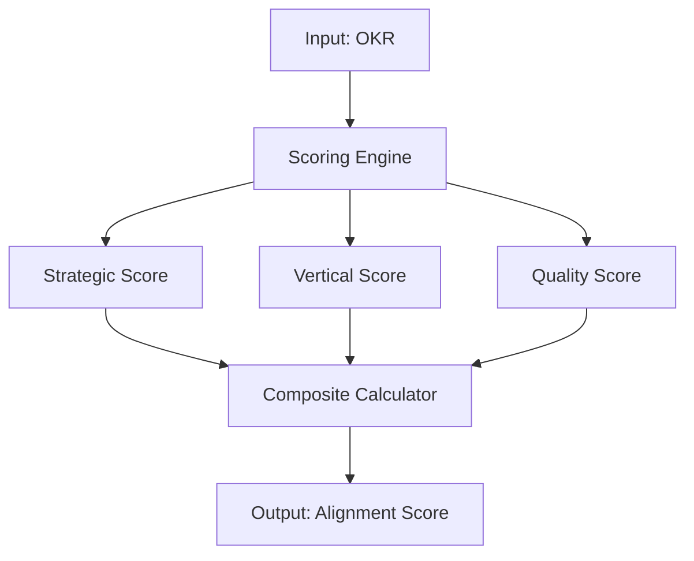
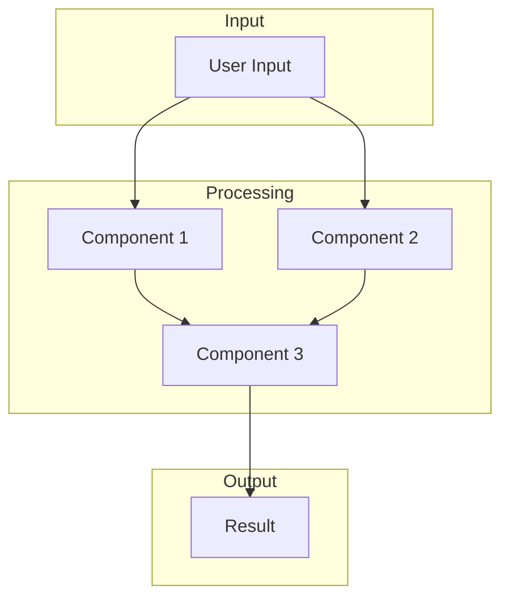
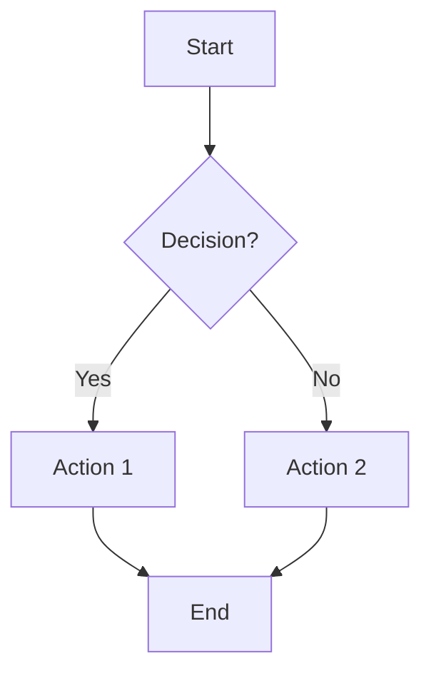
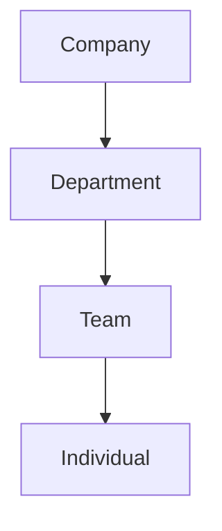

# Patent Submission Generator

Generate presentation-ready structured data for patent submission in JSON format.

## When to Use

- After completing a disclosure with `/patent-disclosure`
- When user asks to "create presentation", "make slides", "prepare submission"
- When preparing for patent review meetings

## Input Requirements

1. **Disclosure JSON** from `/patent-disclosure`, OR
2. **Innovation ID** from `/patent-mining` scan

## Output Format

Generate a JSON file following the schema in `references/submission-schema.json`.

## Presentation Structure

Generate a 7-slide presentation:

### Slide 1: Title

- Bilingual title (Chinese + English)
- Innovation ID / Application number
- Inventor(s) and date
- Company logo reference

### Slide 2: Problem Statement

- 3-4 bullet points describing the problem
- What existing solutions lack
- Why this matters to the business

### Slide 3: Technical Solution

- High-level overview of the solution
- Key innovations (3-5 bullets)
- How it differs from prior art

### Slide 4: System Architecture

- Architecture diagram description
- Mermaid.js code for diagram generation
- Component interactions

### Slide 5: Key Features

- 5-7 key technical features
- Each with brief explanation
- Quantifiable benefits where possible

### Slide 6: Claims Summary

- Independent claim summary
- Key dependent claims
- Competitive moat this creates

### Slide 7: Closing

- Summary statement
- Next steps
- Contact information

## Process

### Step 1: Load Disclosure Data

```
1. Read disclosure JSON
2. Extract metadata, summary, claims
3. Identify key diagrams needed
```

### Step 2: Generate Title Slide

```json
{
  "slide_number": 1,
  "type": "title",
  "content": {
    "title_zh": "Chinese title",
    "title_en": "English title",
    "subtitle": "Patent Disclosure",
    "application_number": "VS-XXX-2026-001",
    "inventors": ["Team Name"],
    "date": "2026-04-08"
  }
}
```

### Step 3: Summarize Problem

Extract from disclosure `problem_statement.background`:
- Condense to 3-4 bullet points
- Focus on pain points
- Emphasize business impact

### Step 4: Distill Solution

Extract from disclosure `summary.overview`:
- High-level approach (1-2 sentences)
- Key innovations as bullets
- Differentiation from alternatives

### Step 5: Create Architecture Diagram

Generate Mermaid.js code:



### Step 6: List Key Features

From disclosure `detailed_description.components`:
- Extract most important features
- Add quantifiable metrics
- Keep to 5-7 items

### Step 7: Summarize Claims

From disclosure `claims`:
- Summarize independent claim in plain language
- List key dependent claims
- Explain competitive advantage

### Step 8: Generate Closing

- Restate main value proposition
- Suggest next steps (formal filing, additional review)
- Provide contact for questions

### Step 9: Generate Speaker Notes

For each slide, add speaker notes:
- Key points to emphasize
- Anticipated questions
- Technical details not on slide

### Step 10: Output JSON and PPTX

**CRITICAL: You MUST execute the generation script to write files to disk.**

**Output location:** All output files are saved to the **current project directory** (where you invoked the command), NOT the plugin installation directory.

After gathering all slide content (Steps 1-9), you MUST run the generation script.

```bash
# Find the plugin's script location
PLUGIN_DIR=$(find ~/.claude -name "generate-submission.py" -path "*/vs-patent-miner/*" 2>/dev/null | head -1 | xargs dirname | xargs dirname)
```

**Option A: From existing disclosure JSON:**
```bash
python3 "$PLUGIN_DIR/scripts/generate-submission.py" \
  [INNOVATION-ID] \
  ./output/submissions/[INNOVATION-ID]-submission.json \
  --from-disclosure ./output/disclosures/[INNOVATION-ID]-disclosure.json
```

**Option B: From disclosure data via stdin:**
```bash
cat ./output/disclosures/[INNOVATION-ID]-disclosure.json | \
  python3 "$PLUGIN_DIR/scripts/generate-submission.py" \
  [INNOVATION-ID] \
  ./output/submissions/[INNOVATION-ID]-submission.json
```

The script will:
1. Generate submission JSON
2. Automatically generate PPTX (if python-pptx is installed)

Verify the files were created in the **current project**:
```bash
ls -la ./output/submissions/
```

**DO NOT skip the script execution. The script ensures files are written to disk.**

**IMPORTANT:** Output paths like `./output/submissions/` are relative to the current working directory (your project), not the plugin directory.

### Step 11: Render Mermaid Diagrams

If Mermaid CLI is available, render diagrams to images:

```bash
# For each diagram in the submission
mmdc -i diagram.mmd -o output/submissions/diagrams/[id]-diagram-[n].png \
  -b transparent -w 1200
```

### Step 12: Automatic PPTX Generation

After saving JSON, automatically generate PowerPoint presentation:

```bash
# Check if python-pptx is available
python3 -c "import pptx" 2>/dev/null

# Find the plugin's pptx generator script
PPTX_SCRIPT=$(find ~/.claude -name "generate-pptx.py" -path "*/vs-patent-miner/*" 2>/dev/null | head -1)

# Generate PPTX (paths relative to current project)
python3 "$PPTX_SCRIPT" \
  ./output/submissions/[innovation-id]-submission.json \
  ./output/submissions/[innovation-id]-submission.pptx
```

**Output files (in your project directory):**
```
[YOUR_PROJECT]/
└── output/submissions/
    ├── INV-001-submission.json           # Structured data
    ├── INV-001-submission.pptx           # PowerPoint presentation
    └── diagrams/
        ├── INV-001-diagram-1.png         # Rendered Mermaid diagrams
        └── INV-001-diagram-2.png
```

**If python-pptx unavailable:**
- JSON is still generated
- Warning message displayed with installation instructions
- User can manually run `/pptx-generator` after installing

## Commands

- `/patent-submission [id]` — Generate submission for specific innovation (JSON + PPTX)
- `/patent-submission [id] --no-pptx` — Generate JSON only, skip PPTX
- `/patent-submission --all` — Generate submissions for all disclosed innovations
- `/patent-submission --from-disclosure [path]` — Generate from disclosure JSON file

## Mermaid Diagram Templates

### Architecture Diagram



### Flowchart



### Hierarchy



## Example Output

See `references/submission-example.json` for a complete example.
